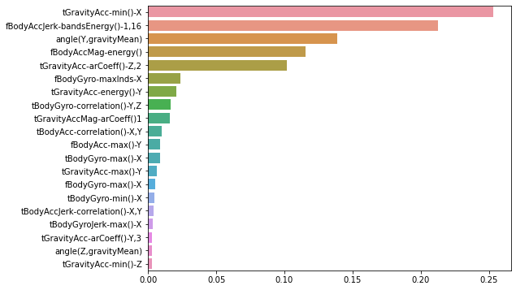

30명에게 스마트폰 센서를 장착한 뒤 사람의 동작과 관련된 여려가지 피처를 수집한 데이터  
수집된 피처 세트를 기반으로 결정 트리를 이용해 어떤 동작인지 예측


```python
import pandas as pd
import matplotlib.pyplot as plt
%matplotlib inline

#features.txt 파일
feature_df=pd.read_csv('./UCI HAR Dataset/features.txt',sep='\s+',
                      header=None,names=['column_index','column_name']) #\s+는 공백이 1개 이상이라는 뜻

#feature명 index를 제거하고 피처명만 리스트 객체로 생성한 뒤 샘플로 10개만 추출
feature_name=feature_df.iloc[:,1].values.tolist()
print('전체에서 10개의 피처명만 추출 :',feature_name[:10])
```

    전체에서 10개의 피처명만 추출 : ['tBodyAcc-mean()-X', 'tBodyAcc-mean()-Y', 'tBodyAcc-mean()-Z', 'tBodyAcc-std()-X', 'tBodyAcc-std()-Y', 'tBodyAcc-std()-Z', 'tBodyAcc-mad()-X', 'tBodyAcc-mad()-Y', 'tBodyAcc-mad()-Z', 'tBodyAcc-max()-X']
    

인체의 움직임과 관련된 속성의 평균,표준편차가 X,Y,Z축 값으로 돼있음을 유추 가능

#### features.txt는 중복된 피처명을 가지고 있는데 이는 dataframe에 로드하면 오류가 발생하므로 원본 피처명에 조금씩 다른 문자 추가 필요함

중복된 피처명 확인


```python
feature_dup_df=feature_df.groupby('column_name').count()
print(feature_dup_df[feature_dup_df['column_index']>1].count())
feature_dup_df[feature_dup_df['column_index']>1].head()
```

    column_index    42
    dtype: int64
    


<div>
<style scoped>
    .dataframe tbody tr th:only-of-type {
        vertical-align: middle;
    }

    .dataframe tbody tr th {
        vertical-align: top;
    }

    .dataframe thead th {
        text-align: right;
    }
</style>
<table border="1" class="dataframe">
  <thead>
    <tr style="text-align: right;">
      <th></th>
      <th>column_index</th>
    </tr>
    <tr>
      <th>column_name</th>
      <th></th>
    </tr>
  </thead>
  <tbody>
    <tr>
      <th>fBodyAcc-bandsEnergy()-1,16</th>
      <td>3</td>
    </tr>
    <tr>
      <th>fBodyAcc-bandsEnergy()-1,24</th>
      <td>3</td>
    </tr>
    <tr>
      <th>fBodyAcc-bandsEnergy()-1,8</th>
      <td>3</td>
    </tr>
    <tr>
      <th>fBodyAcc-bandsEnergy()-17,24</th>
      <td>3</td>
    </tr>
    <tr>
      <th>fBodyAcc-bandsEnergy()-17,32</th>
      <td>3</td>
    </tr>
  </tbody>
</table>
</div>


42개의 피처명 중복됨


```python
def get_new_feature_name_df(old_feature_name_df):
    feature_dup_df = pd.DataFrame(data=old_feature_name_df.groupby('column_name').cumcount(), columns=['dup_cnt'])
    feature_dup_df = feature_dup_df.reset_index()
    new_feature_name_df = pd.merge(old_feature_name_df.reset_index(), feature_dup_df, how='outer')
    new_feature_name_df['column_name'] = new_feature_name_df[['column_name', 'dup_cnt']].apply(lambda x : x[0]+'_'+str(x[1]) 
                                                                                           if x[1] >0 else x[0] ,  axis=1)
    new_feature_name_df = new_feature_name_df.drop(['index'], axis=1)
    return new_feature_name_df
```


```python
import pandas as pd

def get_human_dataset( ):
    
    # 각 데이터 파일들은 공백으로 분리되어 있으므로 read_csv에서 공백 문자를 sep으로 할당.
    feature_name_df = pd.read_csv('./UCI HAR Dataset/features.txt',sep='\s+',
                        header=None,names=['column_index','column_name'])
    
    # 중복된 feature명을 새롭게 수정하는 get_new_feature_name_df()를 이용하여 새로운 feature명 DataFrame생성. 
    new_feature_name_df = get_new_feature_name_df(feature_name_df)
    
    # DataFrame에 피처명을 컬럼으로 부여하기 위해 리스트 객체로 다시 변환
    feature_name = new_feature_name_df.iloc[:, 1].values.tolist()
    
    # 학습 피처 데이터 셋과 테스트 피처 데이터을 DataFrame으로 로딩. 컬럼명은 feature_name 적용
    X_train = pd.read_csv('./UCI HAR Dataset/train/X_train.txt',sep='\s+', names=feature_name )
    X_test = pd.read_csv('./UCI HAR Dataset/test/X_test.txt',sep='\s+', names=feature_name)
    
    # 학습 레이블과 테스트 레이블 데이터을 DataFrame으로 로딩하고 컬럼명은 action으로 부여
    y_train = pd.read_csv('./UCI HAR Dataset/train/y_train.txt',sep='\s+',header=None,names=['action'])
    y_test = pd.read_csv('./UCI HAR Dataset/test/y_test.txt',sep='\s+',header=None,names=['action'])
    
    # 로드된 학습/테스트용 DataFrame을 모두 반환 
    return X_train, X_test, y_train, y_test


X_train, X_test, y_train, y_test = get_human_dataset()
```


```python
print('학습 피처 데이터셋')
print(X_train.info())
```

    학습 피처 데이터셋
    <class 'pandas.core.frame.DataFrame'>
    RangeIndex: 7352 entries, 0 to 7351
    Columns: 561 entries, tBodyAcc-mean()-X to angle(Z,gravityMean)
    dtypes: float64(561)
    memory usage: 31.5 MB
    None
    


```python
X_train.head()
```


<div>
<style scoped>
    .dataframe tbody tr th:only-of-type {
        vertical-align: middle;
    }

    .dataframe tbody tr th {
        vertical-align: top;
    }

    .dataframe thead th {
        text-align: right;
    }
</style>
<table border="1" class="dataframe">
  <thead>
    <tr style="text-align: right;">
      <th></th>
      <th>tBodyAcc-mean()-X</th>
      <th>tBodyAcc-mean()-Y</th>
      <th>tBodyAcc-mean()-Z</th>
      <th>tBodyAcc-std()-X</th>
      <th>tBodyAcc-std()-Y</th>
      <th>tBodyAcc-std()-Z</th>
      <th>tBodyAcc-mad()-X</th>
      <th>tBodyAcc-mad()-Y</th>
      <th>tBodyAcc-mad()-Z</th>
      <th>tBodyAcc-max()-X</th>
      <th>...</th>
      <th>fBodyBodyGyroJerkMag-meanFreq()</th>
      <th>fBodyBodyGyroJerkMag-skewness()</th>
      <th>fBodyBodyGyroJerkMag-kurtosis()</th>
      <th>angle(tBodyAccMean,gravity)</th>
      <th>angle(tBodyAccJerkMean),gravityMean)</th>
      <th>angle(tBodyGyroMean,gravityMean)</th>
      <th>angle(tBodyGyroJerkMean,gravityMean)</th>
      <th>angle(X,gravityMean)</th>
      <th>angle(Y,gravityMean)</th>
      <th>angle(Z,gravityMean)</th>
    </tr>
  </thead>
  <tbody>
    <tr>
      <th>0</th>
      <td>0.288585</td>
      <td>-0.020294</td>
      <td>-0.132905</td>
      <td>-0.995279</td>
      <td>-0.983111</td>
      <td>-0.913526</td>
      <td>-0.995112</td>
      <td>-0.983185</td>
      <td>-0.923527</td>
      <td>-0.934724</td>
      <td>...</td>
      <td>-0.074323</td>
      <td>-0.298676</td>
      <td>-0.710304</td>
      <td>-0.112754</td>
      <td>0.030400</td>
      <td>-0.464761</td>
      <td>-0.018446</td>
      <td>-0.841247</td>
      <td>0.179941</td>
      <td>-0.058627</td>
    </tr>
    <tr>
      <th>1</th>
      <td>0.278419</td>
      <td>-0.016411</td>
      <td>-0.123520</td>
      <td>-0.998245</td>
      <td>-0.975300</td>
      <td>-0.960322</td>
      <td>-0.998807</td>
      <td>-0.974914</td>
      <td>-0.957686</td>
      <td>-0.943068</td>
      <td>...</td>
      <td>0.158075</td>
      <td>-0.595051</td>
      <td>-0.861499</td>
      <td>0.053477</td>
      <td>-0.007435</td>
      <td>-0.732626</td>
      <td>0.703511</td>
      <td>-0.844788</td>
      <td>0.180289</td>
      <td>-0.054317</td>
    </tr>
    <tr>
      <th>2</th>
      <td>0.279653</td>
      <td>-0.019467</td>
      <td>-0.113462</td>
      <td>-0.995380</td>
      <td>-0.967187</td>
      <td>-0.978944</td>
      <td>-0.996520</td>
      <td>-0.963668</td>
      <td>-0.977469</td>
      <td>-0.938692</td>
      <td>...</td>
      <td>0.414503</td>
      <td>-0.390748</td>
      <td>-0.760104</td>
      <td>-0.118559</td>
      <td>0.177899</td>
      <td>0.100699</td>
      <td>0.808529</td>
      <td>-0.848933</td>
      <td>0.180637</td>
      <td>-0.049118</td>
    </tr>
    <tr>
      <th>3</th>
      <td>0.279174</td>
      <td>-0.026201</td>
      <td>-0.123283</td>
      <td>-0.996091</td>
      <td>-0.983403</td>
      <td>-0.990675</td>
      <td>-0.997099</td>
      <td>-0.982750</td>
      <td>-0.989302</td>
      <td>-0.938692</td>
      <td>...</td>
      <td>0.404573</td>
      <td>-0.117290</td>
      <td>-0.482845</td>
      <td>-0.036788</td>
      <td>-0.012892</td>
      <td>0.640011</td>
      <td>-0.485366</td>
      <td>-0.848649</td>
      <td>0.181935</td>
      <td>-0.047663</td>
    </tr>
    <tr>
      <th>4</th>
      <td>0.276629</td>
      <td>-0.016570</td>
      <td>-0.115362</td>
      <td>-0.998139</td>
      <td>-0.980817</td>
      <td>-0.990482</td>
      <td>-0.998321</td>
      <td>-0.979672</td>
      <td>-0.990441</td>
      <td>-0.942469</td>
      <td>...</td>
      <td>0.087753</td>
      <td>-0.351471</td>
      <td>-0.699205</td>
      <td>0.123320</td>
      <td>0.122542</td>
      <td>0.693578</td>
      <td>-0.615971</td>
      <td>-0.847865</td>
      <td>0.185151</td>
      <td>-0.043892</td>
    </tr>
  </tbody>
</table>
<p>5 rows × 561 columns</p>
</div>


```python
y_train
```


<div>
<style scoped>
    .dataframe tbody tr th:only-of-type {
        vertical-align: middle;
    }

    .dataframe tbody tr th {
        vertical-align: top;
    }

    .dataframe thead th {
        text-align: right;
    }
</style>
<table border="1" class="dataframe">
  <thead>
    <tr style="text-align: right;">
      <th></th>
      <th>action</th>
    </tr>
  </thead>
  <tbody>
    <tr>
      <th>0</th>
      <td>5</td>
    </tr>
    <tr>
      <th>1</th>
      <td>5</td>
    </tr>
    <tr>
      <th>2</th>
      <td>5</td>
    </tr>
    <tr>
      <th>3</th>
      <td>5</td>
    </tr>
    <tr>
      <th>4</th>
      <td>5</td>
    </tr>
    <tr>
      <th>...</th>
      <td>...</td>
    </tr>
    <tr>
      <th>7347</th>
      <td>2</td>
    </tr>
    <tr>
      <th>7348</th>
      <td>2</td>
    </tr>
    <tr>
      <th>7349</th>
      <td>2</td>
    </tr>
    <tr>
      <th>7350</th>
      <td>2</td>
    </tr>
    <tr>
      <th>7351</th>
      <td>2</td>
    </tr>
  </tbody>
</table>
<p>7352 rows × 1 columns</p>
</div>


```python
y_train['action'].value_counts()
```


    6    1407
    5    1374
    4    1286
    1    1226
    2    1073
    3     986
    Name: action, dtype: int64


```python
from sklearn.tree import DecisionTreeClassifier
from sklearn.metrics import accuracy_score

dt_clf= DecisionTreeClassifier(random_state=156)
dt_clf.fit(X_train,y_train)
pred=dt_clf.predict(X_test)
acc=accuracy_score(y_test,pred)
print('결정 트리 예측 정확도 : {0:4f}'.format(acc))
```

    결정 트리 예측 정확도 : 0.854768
    


```python
print('DecisionTTreeClassifier 기본 하이퍼 파라미터 :',dt_clf.get_params())
```

    DecisionTTreeClassifier 기본 하이퍼 파라미터 : {'ccp_alpha': 0.0, 'class_weight': None, 'criterion': 'gini', 'max_depth': None, 'max_features': None, 'max_leaf_nodes': None, 'min_impurity_decrease': 0.0, 'min_impurity_split': None, 'min_samples_leaf': 1, 'min_samples_split': 2, 'min_weight_fraction_leaf': 0.0, 'random_state': 156, 'splitter': 'best'}
    


```python
from sklearn.model_selection import GridSearchCV

params = {
    'max_depth' : [ 6, 8 ,10, 12, 16 ,20, 24]
}

grid_cv = GridSearchCV(dt_clf, param_grid=params, scoring='accuracy', cv=5, verbose=1 )
grid_cv.fit(X_train , y_train)
print('GridSearchCV 최고 평균 정확도 수치:{0:.4f}'.format(grid_cv.best_score_))
print('GridSearchCV 최적 하이퍼 파라미터:', grid_cv.best_params_)

```

    Fitting 5 folds for each of 7 candidates, totalling 35 fits
    GridSearchCV 최고 평균 정확도 수치:0.8513
    GridSearchCV 최적 하이퍼 파라미터: {'max_depth': 16}
    


```python
# GridSearchCV객체의 cv_results_ 속성을 DataFrame으로 생성. 
cv_results_df = pd.DataFrame(grid_cv.cv_results_)

# max_depth 파라미터 값과 그때의 테스트(Evaluation)셋, 학습 데이터 셋의 정확도 수치 추출
# 사이킷런 버전이 업그레이드 되면서 아래의 GridSearchCV 객체의 cv_results_에서 mean_train_score는 더이상 제공되지 않습니다
# cv_results_df[['param_max_depth', 'mean_test_score', 'mean_train_score']]

# max_depth 파라미터 값과 그때의 테스트(Evaluation)셋, 학습 데이터 셋의 정확도 수치 추출
cv_results_df[['param_max_depth', 'mean_test_score']]

```


<div>
<style scoped>
    .dataframe tbody tr th:only-of-type {
        vertical-align: middle;
    }

    .dataframe tbody tr th {
        vertical-align: top;
    }

    .dataframe thead th {
        text-align: right;
    }
</style>
<table border="1" class="dataframe">
  <thead>
    <tr style="text-align: right;">
      <th></th>
      <th>param_max_depth</th>
      <th>mean_test_score</th>
    </tr>
  </thead>
  <tbody>
    <tr>
      <th>0</th>
      <td>6</td>
      <td>0.850791</td>
    </tr>
    <tr>
      <th>1</th>
      <td>8</td>
      <td>0.851069</td>
    </tr>
    <tr>
      <th>2</th>
      <td>10</td>
      <td>0.851209</td>
    </tr>
    <tr>
      <th>3</th>
      <td>12</td>
      <td>0.844135</td>
    </tr>
    <tr>
      <th>4</th>
      <td>16</td>
      <td>0.851344</td>
    </tr>
    <tr>
      <th>5</th>
      <td>20</td>
      <td>0.850800</td>
    </tr>
    <tr>
      <th>6</th>
      <td>24</td>
      <td>0.849440</td>
    </tr>
  </tbody>
</table>
</div>


```python
max_depths = [ 6, 8 ,10, 12, 16 ,20, 24]
# max_depth 값을 변화 시키면서 그때마다 학습과 테스트 셋에서의 예측 성능 측정
for depth in max_depths:
    dt_clf = DecisionTreeClassifier(max_depth=depth, random_state=156)
    dt_clf.fit(X_train , y_train)
    pred = dt_clf.predict(X_test)
    accuracy = accuracy_score(y_test , pred)
    print('max_depth = {0} 정확도: {1:.4f}'.format(depth , accuracy))
```

    max_depth = 6 정확도: 0.8558
    max_depth = 8 정확도: 0.8707
    max_depth = 10 정확도: 0.8673
    max_depth = 12 정확도: 0.8646
    max_depth = 16 정확도: 0.8575
    max_depth = 20 정확도: 0.8548
    max_depth = 24 정확도: 0.8548
    


```python
from sklearn.model_selection import GridSearchCV


params={
    'max_depth':[8,12,16,20],
    'min_samples_split':[16,24],
}

grid_cv=GridSearchCV(dt_clf,param_grid=params,scoring='accuracy',cv=5,verbose=1)
grid_cv.fit(X_train,y_train)
print('gridcv 최고 평균 정확도: {0:4f}'.format(grid_cv.best_score_))
print('최적 하이퍼 파라미터 : ',grid_cv.best_params_)
```

    Fitting 5 folds for each of 8 candidates, totalling 40 fits
    gridcv 최고 평균 정확도: 0.854879
    최적 하이퍼 파라미터 :  {'max_depth': 8, 'min_samples_split': 16}
    


```python
best_df_clf=grid_cv.best_estimator_ #최적 하이퍼 파라미터로 학습 완료된 객체
pred1=best_df_clf.predict(X_test)
acc=accuracy_score(y_test,pred1)
print('결정 트리 예측 정확도:{0:4f}'.format(acc))
```

    결정 트리 예측 정확도:0.871734
    


```python
import seaborn as sns

ftr_importances_values=best_df_clf.feature_importances_

#막대그래프 쉽게 표현하기 위해 시리즈 변환
ftr_importances=pd.Series(ftr_importances_values,index=X_train.columns)

#중요도 순으로 시리즈 정렬
ftr_top=ftr_importances.sort_values(ascending=False)[:20]
plt.figure(figsize=(8,6))
sns.barplot(x=ftr_top,y=ftr_top.index)
```


    <AxesSubplot:>


    

    


```python

```
